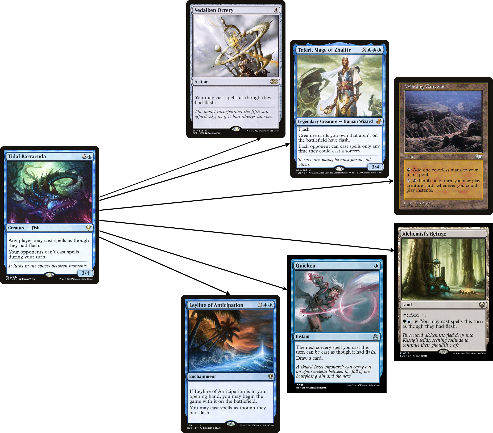
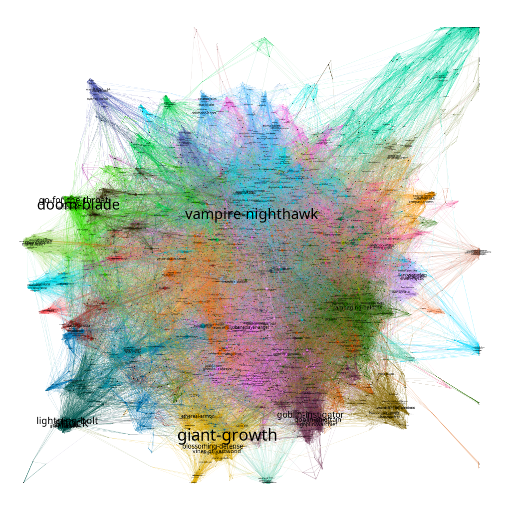

# MTGCardsSimilarity
MTGCardsSimilarity aims to complete the similarity graph got from [Edhrec.com](https://edhrec.com/)
to help players to find similar Magic cards. The project is for now in development.

## Edhrec similar features

[Edhrec.com](https://edhrec.com/) has a feature called "similar cards" 
that allow finding six similar cards of any card. 
For example, for 'Tidal Barracuda'.

However, it is mainly focused on the sentence "Any player may cast spells as though they had flash."
and does not propose cards similar to the sentence "Your opponents can’t cast spells during your turn."
And cards that looks like similar to this effect exists. 
(e.g. [Dosan the Falling Leaf](https://scryfall.com/card/chk/205/dosan-the-falling-leaf), 
[Grand Abolisher](https://scryfall.com/card/big/2/grand-abolisher) or 
[Conqueror's Flail](https://scryfall.com/card/2x2/302/conquerors-flail))

The goal of this project is to exploit all existing similar cards already annotated to list all similar
cards according to the feature desired.

## The Similarity graph

One things funny with the similar cards feature, is that if we click on similar card of particular cards,
we get other similar cards, and so on...
So, if we get all similar cards of all similar cards, we can get a graph, where
a node is a magic card, and a directed edge represent a card similar to another card.

Do all cards are linked? Yes!

Gephi has been used to create the visualisation :
- Color has been assigned with [Louvain communities](https://networkx.org/documentation/stable/reference/algorithms/generated/networkx.algorithms.community.louvain.louvain_communities.html). 
    (187 community in total)
- Size of the node is the number of cards referencing it (In-degree). The most "cited" card is
    [Giant Growth](https://scryfall.com/card/fdn/223/giant-growth) with 335 "citations".
- The layout algorithm is Force Atlas 2.

# Features
- [x] Getting the graph from edhrec
- [x] Use graph visualisation (Gephi, PyGraphistry, Graphviz...) visualise the graph.
- - [x] A simple community detection and layout for basic visualisation.
- - [ ] Try other layout for better community visualisation.
- [ ] Use edge completion algorithm to get more similar cards (Jaccard similarity).
- [ ] Use cards embedding to allow use of GNN models.
- - [ ] Try to embed cards with existing models (e.g. [MTH-card2vec](https://github.com/afreefaw/MTG-card2vec))
- - [ ] Use GNN models for edges detections.
- [ ] Do a state of the art for embedding of each feature of the cards (mana cost, ability, power...).
- [ ] Use both the graph, the embedding of cards and its feature to predict link between each feature of each cards. 
- [ ] Make a cool design (Apps, Website...).
- [ ] Enjoy and eat a pancake. Pancakes are good. 

